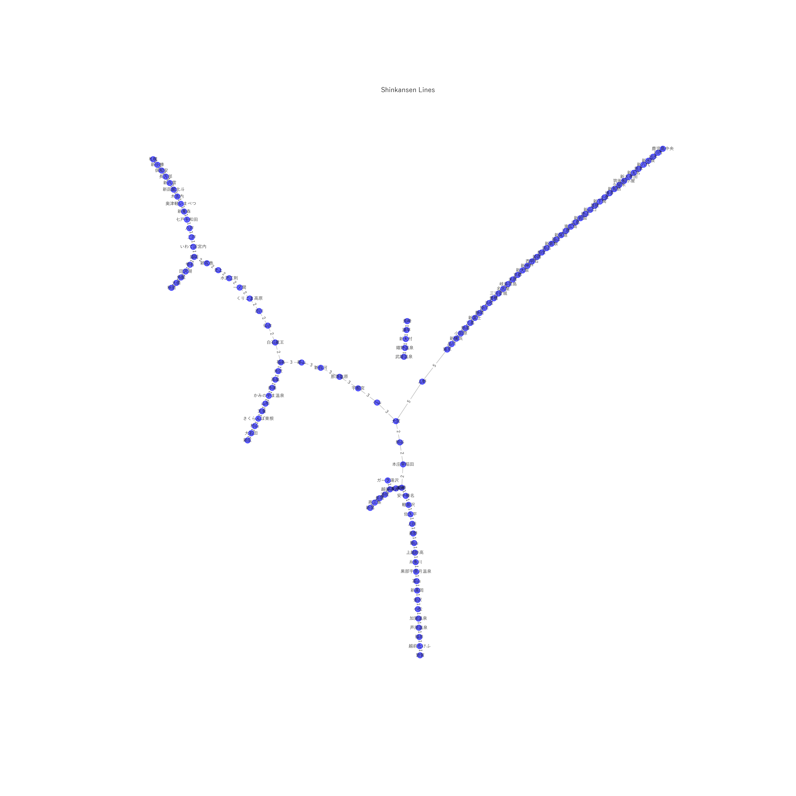
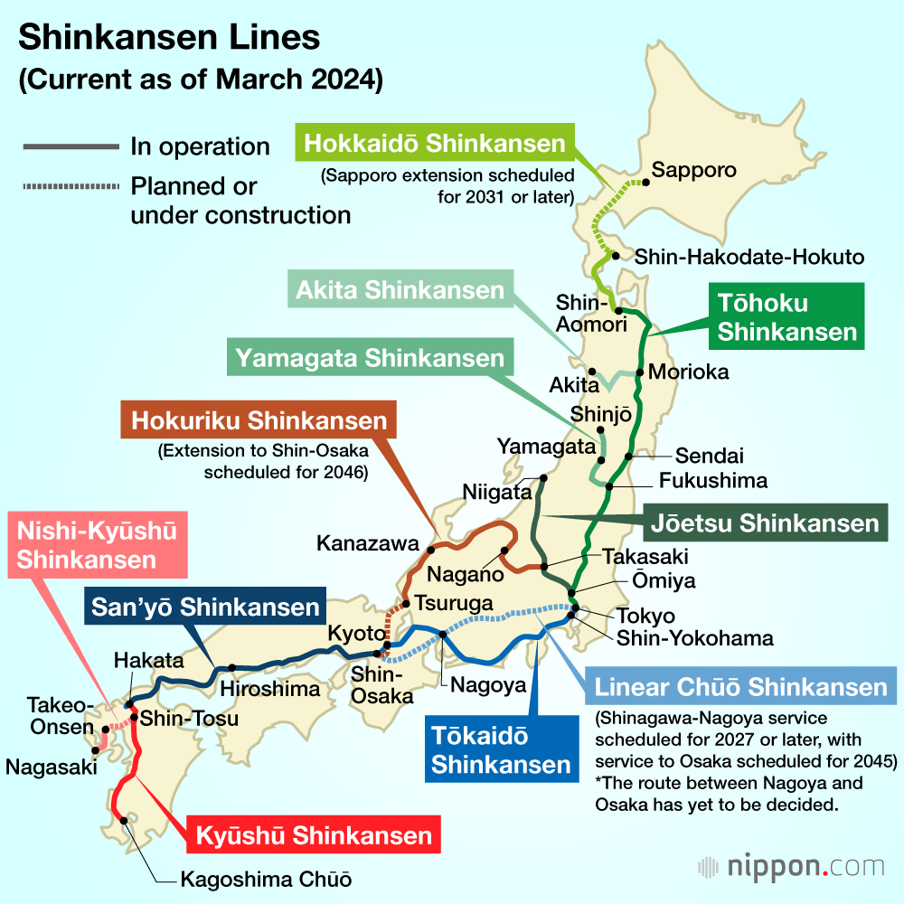

# Community Analysis of the Shinkansen High-Speed Railway Network in Japan

In this project, we constructed a Shinkansen network in Japan that aligns with real-world conditions. Stations are represented as nodes, railway lines as edges, and the number of lines as edge weights.

Based on the constructed weighted graph, we performed a basic analysis of the Shinkansen network and provided several Python methods for other programs to utilize. To study the Japanese Shinkansen network, we employed Infomap and Louvain methods for community detection and compared the results with real-world scenarios. The findings show that both methods correspond well with reality, but differ in overall coherence and granularity. Overall, the Infomap method better reflects the cross-line operations of the Shinkansen, while Louvain highlights regional connectivity within lines.

## Introduction to the Japanese Shinkansen

The Japanese Shinkansen is the backbone of Japan’s high-speed railway system. Since its launch in 1964, it has developed into a comprehensive transportation network connecting major cities nationwide. Known for its high speed, efficiency, and safety, the Shinkansen currently operates at speeds up to 320 km/h. The network includes multiple lines, such as Tokaido, Sanyo, Tohoku, Hokuriku, and Hokkaido Shinkansen, spanning from Hokkaido to Kyushu with a total length exceeding 3,000 km. As a vital part of modern transportation infrastructure, the Shinkansen significantly enhances regional connectivity and economic activity while minimizing environmental impacts through electric power and optimized operations. Its design and operational experience serve as a global reference for high-speed rail development.

The Japanese Shinkansen network comprises multiple lines, each serving specific regions and addressing varying transportation demands.

1. **Tokaido Shinkansen**: Connects Tokyo, Nagoya, and Osaka, covering Japan's most economically developed Tokaido region.
2. **Sanyo Shinkansen**: Links Osaka and Hakata (Fukuoka City), connecting to the Tokaido Shinkansen. It spans western Honshu and serves as the primary high-speed route to Kyushu.
3. **Tohoku Shinkansen**: Starts in Tokyo, extending northeast to Shin-Aomori, covering major cities like Fukushima, Sendai, and Morioka, serving as the main artery for the Tohoku region.
4. **Hokuriku Shinkansen**: Originates in Tokyo, passing through Nagano and Toyama, and terminates in Kanazawa. It serves the Hokuriku region and connects central Japan with the Tokyo metropolitan area.
5. **Hokkaido Shinkansen**: Extends from Shin-Aomori through the Seikan Tunnel to Hakodate in Hokkaido, with future plans to extend to Sapporo. It bridges Honshu and Hokkaido.
6. **Kyushu Shinkansen**: Comprises a southern section from Hakata to Kagoshima-Chuo and a planned northern section connecting Nagasaki, mainly serving the Kyushu region.
7. **West Kyushu Shinkansen**: Connects Hakata and Nagasaki, forming part of the Kyushu Shinkansen but not yet linked to the northern section.
8. **Joetsu Shinkansen**: Connects Tokyo and Niigata, traversing Gunma and Nagano, providing high-speed service to central and northern Japan.
9. **Akita and Yamagata Shinkansen**: Extend from Tokyo to Akita and Yamagata, serving inland areas of the Tohoku region.

## Basic Data of the Japanese Shinkansen Network

Using the Shinkansen operating system, stations are nodes, railway lines are edges, and the number of lines as edge weights. This data forms an undirected weighted graph, which underwent basic parameter analysis.

The visualization shows that the West Kyushu Shinkansen appears as an independent part of the network due to its lack of connection to the northern section. Other lines are well-connected, forming an integrated network.

Statistically, the Japanese Shinkansen network comprises 124 nodes (stations) and 122 edges (lines), with an average degree of 1.97, an average clustering coefficient of 0.33, and a diameter of 71 (excluding the West Kyushu section) or 5 (for the West Kyushu section).

## Community Detection Methods

### Infomap Method

Infomap is an information-theory-based community detection method for grouping nodes in a network. It minimizes the encoding length of a random walker's path to reveal community structures. Infomap models the network as an information flow system, simulating the movement of a random walker. Groups of nodes frequently visited by the walker are classified as a community to reduce encoding length.

Compared to other methods, Infomap is efficient and versatile, capable of handling directed, undirected, and weighted networks. Its results are interpretable, reflecting actual information flow patterns, making it a valuable tool for complex network research.

### Louvain Method

The Louvain method is a modularity-based community detection algorithm revealing community structures by iteratively optimizing the modularity metric. It maximizes internal connectivity within groups while minimizing connections between groups.

The process includes:

1. **Local Modularity Optimization**: Initially, each node is an independent community. Nodes are iteratively merged into neighboring communities to increase modularity.
2. **Community Aggregation and Global Optimization**: Communities are treated as super-nodes, forming a simplified network. The process repeats until modularity converges or reaches a maximum.

The Louvain method is efficient, scalable, and widely used in social, biological, and information networks.

We used the `community_louvain` and `infomap` third-party libraries to partition the Shinkansen network into communities, storing results in `communities_infomap.json` and `communities_louvain.json`.

## Community Detection Results

### Infomap Results

**Community 1**: `Tokyo, Ueno, Omiya, Oyama, Utsunomiya, Nasu-Shiobara, Shin-Shirakawa, Koriyama, Fukushima, Kumagaya, Honjo-Waseda, Takasaki, Jomokogen, Echigo-Yuzawa, Urasa, Nagaoka, Tsubame-Sanjo, Niigata, Gala-Yuzawa, Annaka-Haruna`

This community includes part of the Tohoku Shinkansen (Tokyo to Nasu-Shiobara), the Joetsu Shinkansen (Omiya to Niigata), and part of the Hokuriku Shinkansen branch line (Takasaki to Annaka-Haruna). It accurately encompasses the major Shinkansen lines in eastern Japan, indicating that the community detection successfully identified closely related geographic and transportation network relationships.

**Community 2**: `Shinagawa, Shin-Yokohama, Odawara, Atami, Mishima, Shin-Fuji, Shizuoka, Kakegawa, Hamamatsu, Toyohashi, Mikawa-Anjo, Nagoya, Gifu-Hashima, Maibara, Kyoto, Shin-Osaka, Shin-Kobe, Nishi-Akashi, Himeji, Aioi, Okayama, Shin-Kurashiki, Fukuyama, Shin-Onomichi, Mihara, Higashi-Hiroshima, Hiroshima, Shin-Iwakuni, Tokuyama, Shin-Yamaguchi, Asa, Shin-Shimonoseki, Kokura, Hakata, Shin-Tosu, Kurume, Chikugo-Funagoya, Shin-Omuta, Shin-Tamana, Kumamoto, Shin-Yatsushiro, Shin-Minamata, Izumi, Sendai, Kagoshima-Chuo`

This community corresponds accurately to the Tokaido and Sanyo Shinkansen lines and extends to the Kyushu Shinkansen. This is consistent with reality, as these lines form the main trunk extending from Tokyo to Kyushu. The detection results effectively reflect the high connectivity of these lines.

**Community 3**: `Shiroishi-Zao, Sendai, Furukawa, Kurikoma-Kogen, Ichinoseki, Mizusawa-Esashi, Kitakami, Shin-Hanamaki, Morioka, Iwate-Numakunai, Ninohe, Hachinohe, Shichinohe-Towada, Shin-Aomori, Shizukuishi, Tazawako, Kakunodate, Omagari, Akita, Okutsugaru-Imabetsu, Kikonai, Shin-Hakodate-Hokuto, Shin-Yakumo, Oshamambe, Kutchan, Shin-Otaru, Sapporo`

This community includes the northern part of the Tohoku Shinkansen (from Morioka) and the Hokkaido Shinkansen. It also encompasses the Akita Shinkansen and the Hokkaido Shinkansen’s terminal station, Sapporo. The community successfully groups stations in the northeast and Hokkaido directions, demonstrating strong geographic consistency. Additionally, the inclusion of the Akita Shinkansen aligns with its shared tracks with the Tohoku Shinkansen.

**Community 4**: `Karuizawa, Saku-Daira, Ueda, Nagano, Iiyama, Joetsu-Myoko, Itoigawa, Kurobe-Unazukionsen, Toyama, Shin-Takaoka, Kanazawa, Komatsu, Kagaonsen, Awaraonsen, Fukui, Echizen-Takefu, Tsuruga`

This community perfectly matches the Hokuriku Shinkansen, demonstrating the algorithm's sensitivity to geographically connected lines.

**Community 5**: `Yonezawa, Takahata, Akayu, Kaminoyama-Onsen, Yamagata, Tendo, Sakurambo-Higashine, Murayama, Oishida, Shinjo`

The Yamagata Shinkansen is independently identified as a single community, reflecting its characteristics as an independent branch line.

**Community 6**: `Takeo-Onsen, Ureshino-Onsen, Shin-Omura, Isahaya, Nagasaki`

This community corresponds to the West Kyushu Shinkansen, consistent with its independence from other lines.

Overall, the Infomap method effectively divides the Shinkansen network into communities that align well with real-world conditions. The connectivity and geographic relationships between communities are well-reflected, and shared sections of some lines are grouped into the same community, capturing the Shinkansen network's operational characteristics.

### Louvain results

Compared to Infomap, the Louvain algorithm produces more detailed division results, further subdividing some lines into multiple communities. In the new division, the community divisions more clearly reflect regional connectivity within the lines, while the Yamagata Shinkansen, Hokuriku Shinkansen, and Nishi-Kyushu Shinkansen remain as separate community divisions, in line with the Infomap results.

Specifically, around Tokyo, the beginning sections of the Tohoku Shinkansen and Joetsu Shinkansen `Tokyo, Ueno, Omiya, Kumagaya, Honjo Waseda, and Takasaki` are classified as the same neighborhoods, while the middle section of the Tohoku Shinkansen appears as a separate neighborhood of `Koyasan, Utsunomiya, Nasu-Shiobara, Shin-Shirakawa, Koriyama, and Fukushima`.

The Tohoku Shinkansen Northern Terminal and Hokkaido Shinkansen are divided into two sections by Morioka, an important city in northeastern Japan: `Shiraishi Kurao, Sendai, Furukawa, Kurikomagahara, Ichinoseki, Mizusawa-Esashi, Kitakami, Shin-Hanamaki, and Morioka'`, and `Iwatanuma Miyauchi, Ninohe, Hachinohe, Shichinohe, Shin-Aomori, Okutsu-Karuimabeitsu, Mokouchi, Shinkankankan-Kitetsu, Shinkakuhachi-no-mo, Nagamanbe, and Juji-no-Hachiman. Nagamabe, Kuchiyasu, Shin-Otaru, Sapporo`.

The Tokaido Shinkansen and Sanyo Shinkansen are divided into three sections: `Shinagawa, Shin-Yokohama, Odawara, Atami, Mishima, Shin-Fuji, Shizuoka, Kakegawa, Hamamatsu`, `Toyohashi, Mikawa-Anjo, Nagoya, Gifu-Hashima, Yonehara, Kyoto, Shin-Osaka, Shin-Kobe, Nishi-Meishi, Hyogo-Himeji, Aio, Okayama, and Shin-Kurashiki, Fukuyama, Shina-oji, Mihara, Higashi-Hirodo, Hiroshima`, `Shin-Iwakuni, Tokuyama, Shin-Yamaguchi. Tokuyama, Shin-Yamaguchi, Atsuka, Shin-Shimonoseki, Kokura, and Hakata`, and this detailed splitting reflects the regional nature of the traffic flow within the routes.

The Louvain algorithm results in a finer division that better matches the actual regional distribution of the line, highlighting the traffic flow and regional nodes. However, some of the divisions (e.g., the further subdivision of the Tokaido Shinkansen) may lead to a sense of fragmentation in the overall connectivity, which is not as holistic as the previous result.

## Conclusion

By analyzing the Japanese Shinkansen high-speed railroad network, this paper adopts two community discovery methods, Infomap and Louvain, to demonstrate the characteristics of different algorithms in network delineation and their correspondence with the actual situation. The results show that the Infomap method is more inclined to be holistic oriented and can better identify the operational characteristics and connectivity across the lines, while the Louvain method focuses more on the detailed regional segmentation, which is closer to the local traffic characteristics within the lines.

The community segmentation of the Shinkansen network not only validates the effectiveness of the two algorithms, but also reflects the complexity and efficiency of the Japanese high-speed rail network. The results of these analyses help to further understand the operating laws of the Shinkansen network and provide a reference for future traffic planning and optimization. Meanwhile, the methods and codes used in this paper are generalizable and can be extended to the study of other complex transportation networks.

Future work can explore more dynamic network-based community discovery methods to further analyze the changing characteristics of the Shinkansen network under different time scales, thus revealing its potential development trend and optimization space.
